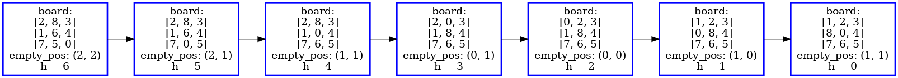
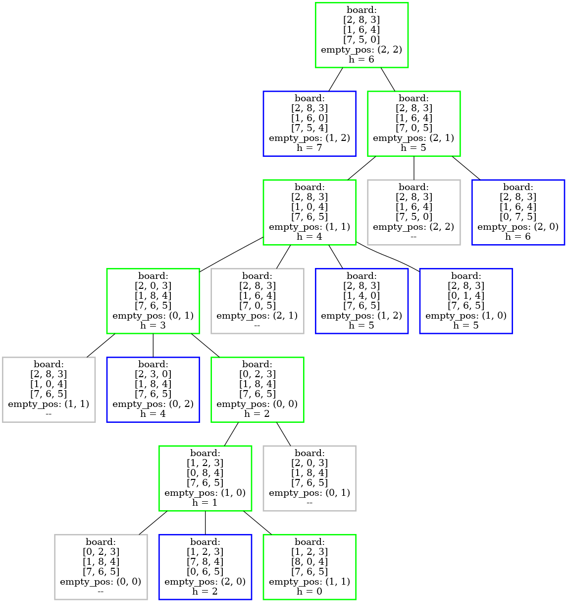
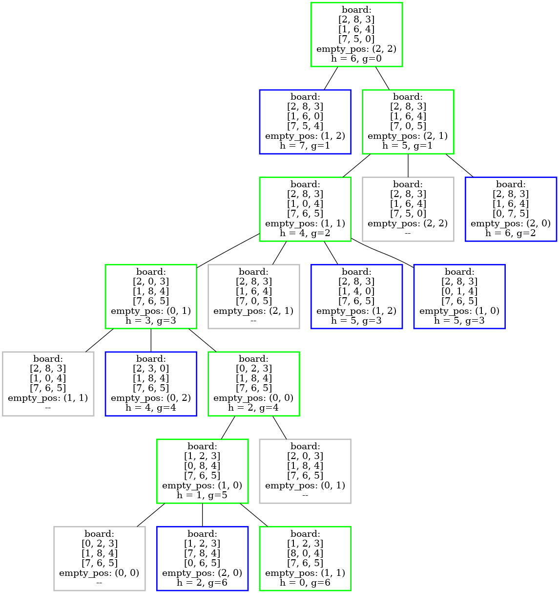
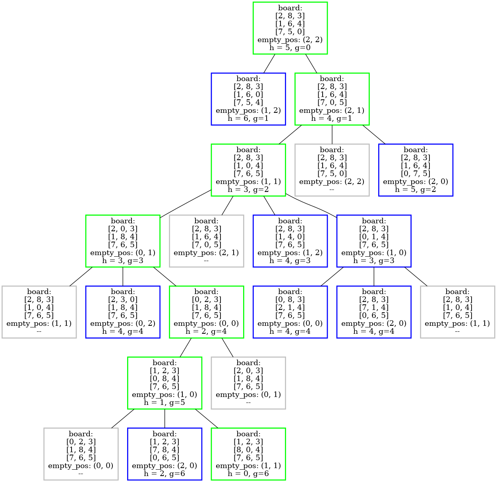

<!-- markdownlint-disable -->

# Prova IA - AB2

## Questão 1

Thiago Ribeiro da Silva

---

## Enunciado:

- Considere o jogo dos 8 números, tal como mostrado em sala de aula, no qual problema consiste em: Dada uma configuração (estado) qualquer, movimente as “peças” em direção a uma configuração alvo (estado objetivo). Apresente uma solução, a este jogo, em pseudo-código (linguagem algorítmica), inclusive dando detalhes da estrutura de dados adotada, para cada um dos 3 seguintes algoritmos: (i) **Algoritmo de busca gulosa**; (ii) **algoritmo A\*** e (iii) **algoritmo de subida de encosta**. Mostre como seria as possíveis execuções, com o passo a passo, para cada um dos 3 algoritmos, nas duas situações seguintes:

---

## Estrutura do Problema

- O tabuleiro do _8-puzzle_ foi configurado como uma classe que armazena a matriz correspondente e possui métodos de validação de entrada e calculo de custo (com base nas heurísticas de distância **euclidiana** e **manhattan**)

```bash
board:
[2, 8, 3]
[1, 6, 4]
[7, 5, 0]
empty_pos: (2, 2)
```

---

## Verificação de viabilidade das Entradas

A verificação de viabilidade de uma configuração do _8-puzzle_ pode ser feita comparando a paridade do número de inversões.

- Uma **inversão** ocorre quando um número maior precede um número menor na lista linearizada do tabuleiro.
- Se a configuração inicial e o estado objetivo têm o mesmo tipo de paridade (ambas com um número par ou ambas com um número ímpar de inversões), então é **possível resolver** o puzzle, movendo-se de um para o outro. Se as paridades forem diferentes, então a configuração inicial **não é resolvível**.

---

## Verificação de viabilidade das Entradas

- Algoritmo de contabilização de inversões:

```bash
def is_solvable(self, goal_state: "BoardState"):

        def count_inversions(state: "BoardState"):
            plan_board = [j for i in state.board for j in i]
            inv_count = 0

            for i in range(0,9):
                for j in range(i+1, 9):
                    if plan_board[j] != 0 and plan_board[i] != 0 and plan_board[i] > plan_board[j]:
                        inv_count += 1
            return inv_count

        self_inv = count_inversions(self)
        goal_inv = count_inversions(goal_state)

        return (self_inv % 2) == (goal_inv % 2)
```

---

## Verificação de viabilidade das Entradas

Entrada 1:

```
Start State          Goal State
1 7 2                1 2 3
8 4 5         -->    8   4
6 3                  7 6 5
```

```python
print("Entrada 1 é resolvível? ", board1_1.is_solvable(goal_state))
```

```
>> Entrada 1 é resolvível?  False
```

---

## Verificação de viabilidade das Entradas

Entrada 2:

```
Start State          Goal State
2 8 3                1 2 3
1 6 4         -->    8   4
7 5                  7 6 5
```

```python
print("Entrada 2 é resolvível? ", board1_2.is_solvable(goal_state))
```

```
>> Entrada 2 é resolvível?  True
```

---

## Algoritmo Hill Climb

- O algoritmo parte do estado inicial e segue sempre escolhendo o melhor vizinho até que se chegue em um máximo local (que pode ser global, mas sem garantias disso), não mantendo uma árvore de estados (memória).

> É como tentar alcançar o cume do Monte Everest em meio a um nevoeiro denso durante uma crise de amnésia. (RUSSEL; NORVIG, 2013, p.159)

```bash
FUNC hill_climb(estado_inicial, estado_objetivo) -> estado_maximo_local
    estado_atual := estado_inicial
    ENQUANTO estado_atual != estado_objetivo:
        estado_vizinho := melhor_sucessor_de(estado_atual)
        SE h(estado_vizinho) >= h(estado_atual):
            RETORNA estado_atual
        estado_atual = estado_vizinho
```

---

## Algoritmo Hill Climb

Solução para a Entrada 2

- distância: Manhattan

```bash
Máximo local encontrado em 6 passos!
current_state = board:
[1, 2, 3]
[8, 0, 4]
[7, 6, 5]
empty_pos: (1, 1)
```



---

## Algoritmo Guloso

- O algoritmo segue uma busca informada, partindo do estado inicial e visitando sempre o vizinho mais próximo do objetivo, com base em uma heurística $f(n) = h(n)$. A fila prioritária possibilita a manutenção de uma árvore de estados

```bash
FUNC greedy_algorithm(estado_inicial, estado_objetivo) -> solução
    visitados := [] # explorados
    fila_prioritaria := [(estado_inicial, h(estado_inicial))] # borda
    ENQUANTO fila_prioritaria tem elementos:
        estado_atual := fila_prioritaria.pop()
        SE estado_atual == estado_objetivo:
            RETORNA solução(estado_atual)

        visitados.add(estado_atual)
        PARA CADA vizinho DE estado_atual:
            SE vizinho NÃO está em visitados:
                fila_prioritaria.push((vizinho, h(vizinho)) # f(n) = h(n)
```

---

## Algoritmo Guloso

Solução para a Entrada 2

- distância: Manhattan

| Cor | Significado                 |
| --- | --------------------------- |
| 🟩  | solução encontrada          |
| 🟦  | na fila prioriária          |
| ⬜  | explorado, mas fora da fila |



---

## Algoritmo A\*

- O algoritmo segue a ideia do **guloso**, mas avalia os nós através da combinação de $g(n)$, o custo par alcançar o nó, e $h(n)$, o custo para ir do nó ao objetivo. Tendo uma heurística **adimissível** e **consistente**, pode chegar a solução ótima

---

## Algoritmo A\*

```bash
FUNC astar(estado_inicial, estado_objetivo) -> solução
    visitados := [] # explorados
    g := {estado_inicial: 0} # g(n)
    fila_prioritaria := [(estado_inicial, h(estado_inicial))] # borda
    ENQUANTO fila_prioritaria tem elementos:
        estado_atual := fila_prioritaria.pop()
        SE estado_atual == estado_objetivo:
            RETORNA solução(estado_atual)

        visitados.add(estado_atual)
        PARA CADA vizinho DE estado_atual:
            custo_caminho := g[estado_atual] + 1
            SE vizinho NÃO está em g OU custo_caminho < g[vizinho]:
                g[vizinho] = custo_caminho
                SE vizinho NÃO está em visitados:
                    fila_prioritaria.push((vizinho, h(vizinho) + g(vizinho)) # f(n) = h(n) + g(n)
```

---

## Algoritmo A\*

Solução para a Entrada 2

- distância: Manhattan

| Cor | Significado                 |
| --- | --------------------------- |
| 🟩  | solução encontrada          |
| 🟦  | na fila prioriária          |
| ⬜  | explorado, mas fora da fila |



---

## Algoritmo A\*

Solução para a Entrada 2

- distância: Eucliana

| Cor | Significado                 |
| --- | --------------------------- |
| 🟩  | solução encontrada          |
| 🟦  | na fila prioriária          |
| ⬜  | explorado, mas fora da fila |



---

## Algoritmo A\*

- É possível observar que a mudança de heurística $h(n)$ para distância eucliana adiciona mais passos (uma expansão a mais na árvore de estados), mas ainda assim chega-se a solução ótima
