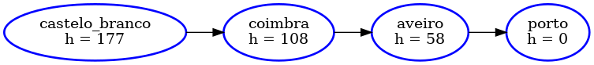
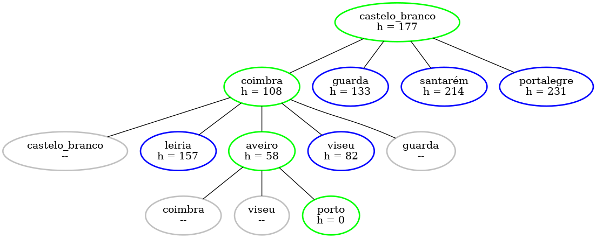
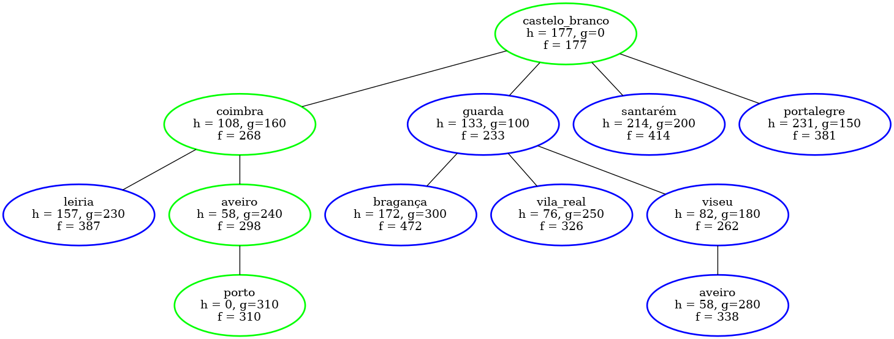

<!-- markdownlint-disable -->

# Prova IA - AB2

## Questão 2

Thiago Ribeiro da Silva

---

## Enunciado:

2. Considere o mapa rodoviário simplificado envolvendo cidades de Portugal, com localização de rotas, bem como o problema de dirigir de X a Y. Assuma o uso da heurística de distância em linha reta. O objetivo é chegar na cidade do **Porto**, saindo da cidade **Castelo Branco**. Mostre como seriam possíveis execuções, com o passo a passo, para cada um dos 3 algoritmos mencionados na questão 1).


---

## Estrutura do Problema

- A estrutura consiste numa classe que representa o grafo, através de lista de adjascências, do mapa rodoviário de Portugal e um dicionário contendo as informações sobre a distância em linha reta das cidades até a cidade objetivo (**Porto**)

```
porto: {('vila_real', 120), ('viana_castelo', 80), ('braga', 50), ('aveiro', 70)}
aveiro: {('coimbra', 80), ('viseu', 100), ('porto', 70)}
braga: {('vila_real', 100), ('viana_castelo', 50), ('porto', 50)}
vila_real: {('bragança', 140), ('guarda', 150), ('porto', 120), ('viseu', 110), ('braga', 100)}
viana_castelo: {('porto', 80), ('braga', 50)}
...
```

```
{'aveiro': 58,
 'beja': 356,
 'braga': 46,
 'bragança': 172,
 'castelo_branco': 177,
  ...
```

---

## Algoritmo Hill Climb

- O algoritmo parte do estado inicial e segue sempre escolhendo o melhor vizinho até que se chegue em um máximo local (que pode ser global, mas sem garantias disso), não mantendo uma árvore de estados (memória).

> É como tentar alcançar o cume do Monte Everest em meio a um nevoeiro denso durante uma crise de amnésia. (RUSSEL; NORVIG, 2013, p.159)

```bash
FUNC hill_climb(estado_inicial, estado_objetivo) -> estado_maximo_local
    estado_atual := estado_inicial
    ENQUANTO estado_atual != estado_objetivo:
        estado_vizinho := melhor_sucessor_de(estado_atual)
        SE h(estado_vizinho) >= h(estado_atual):
            RETORNA estado_atual
        estado_atual = estado_vizinho
```

---

## Algoritmo Hill Climb

Solução para: `Castelo Branco -> Porto`

- heurística: distância em linha reta

```bash
Máximo local encontrado em 3 passos!
['castelo_branco', 'coimbra', 'aveiro', 'porto']
```



---

## Algoritmo Guloso

- O algoritmo segue uma busca informada, partindo do estado inicial e visitando sempre o vizinho mais próximo do objetivo, com base em uma heurística $f(n) = h(n)$. A fila prioritária possibilita a manutenção de uma árvore de estados

```bash
FUNC greedy_algorithm(estado_inicial, estado_objetivo) -> solução
    visitados := [] # explorados
    fila_prioritaria := [(estado_inicial, h(estado_inicial))] # borda
    ENQUANTO fila_prioritaria tem elementos:
        estado_atual := fila_prioritaria.pop()
        SE estado_atual == estado_objetivo:
            RETORNA solução(estado_atual)

        visitados.add(estado_atual)
        PARA CADA vizinho DE estado_atual:
            SE vizinho NÃO está em visitados:
                fila_prioritaria.push((vizinho, h(vizinho)) # f(n) = h(n)
```

---

## Algoritmo Guloso

Solução para: `Castelo Branco -> Porto`

- heurística: distância em linha reta

| Cor | Significado                 |
| --- | --------------------------- |
| 🟩  | solução encontrada          |
| 🟦  | na fila prioriária          |
| ⬜  | explorado, mas fora da fila |



---

## Algoritmo A\*

- O algoritmo segue a ideia do **guloso**, mas avalia os nós através da combinação de $g(n)$, o custo par alcançar o nó, e $h(n)$, o custo para ir do nó ao objetivo. Tendo uma heurística **adimissível** e **consistente**, pode chegar a solução ótima

---

## Algoritmo A\*

```bash
FUNC astar(estado_inicial, estado_objetivo) -> solução
   visitados := [] # explorados
   g := {estado_inicial: 0} # g(n)
   fila_prioritaria := [(estado_inicial, h(estado_inicial))] # borda
   ENQUANTO fila_prioritaria tem elementos:
       estado_atual := fila_prioritaria.pop()
       SE estado_atual == estado_objetivo:
           RETORNA solução(estado_atual)

       visitados.add(estado_atual)
       PARA CADA vizinho DE estado_atual:
           custo_caminho := g[estado_atual] + 1
           SE vizinho NÃO está em g OU custo_caminho < g[vizinho]:
               g[vizinho] = custo_caminho
               SE vizinho NÃO está em visitados:
                   fila_prioritaria.push((vizinho, h(vizinho) + g(vizinho)) # f(n) = h(n) + g(n)
```

---

## Algoritmo A\*

Solução para: `Castelo Branco -> Porto`

- heurística: distância em linha reta + custo de caminho acumulado

| Cor | Significado                 |
| --- | --------------------------- |
| 🟩  | solução encontrada          |
| 🟦  | na fila prioriária          |
| ⬜  | explorado, mas fora da fila |

---

## Algoritmo A\*



---

## Algoritmo Guloso x Algoritmo A\*

- É possível perceber que a adição de $g(n)$ usado no A\* posibilitou uma expansão a mais na árvore de estados. Em um certo momento, o caminho: _Castelo Branco -> Guarda -> Viseu_ era a melhor escolha, mas deixou de ser ao chegar em Aveiro, voltando ao outro caminho (consequentemente o ótimo)
