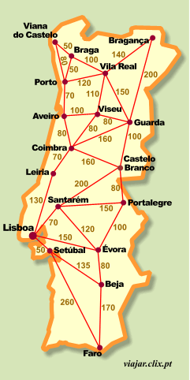

<!-- markdownlint-disable -->

# Prova IA - AB2

## Questão 2

Thiago Ribeiro da Silva

---

## Enunciado:

2. Considere o mapa rodoviário simplificado envolvendo cidades de Portugal, com localização de rotas, bem como o problema de dirigir de X a Y. Assuma o uso da heurística de distância em linha reta. O objetivo é chegar na cidade do Porto, saindo da cidade Castelo Branco. Mostre como seriam possíveis execuções, com o passo a passo, para cada um dos 3 algoritmos mencionados na questão 1).

