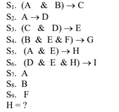

<!-- markdownlint-disable -->

# Prova IA - AB2

## Questão 3

Thiago Ribeiro da Silva

---

## Enunciado:

3. Mostre uma solução de busca heurística (por exemplo, usando o algoritmo A\* ou outra de sua escolha) para um provador de teoremas na lógica proposicional. Mostre sua solução funcionando na situação particular seguinte. Considere uma base de conhecimento (equivalente a regras e fatos) formada pelas sentenças de 1 a 9. Usando tais sentenças, prove H a partir delas.

