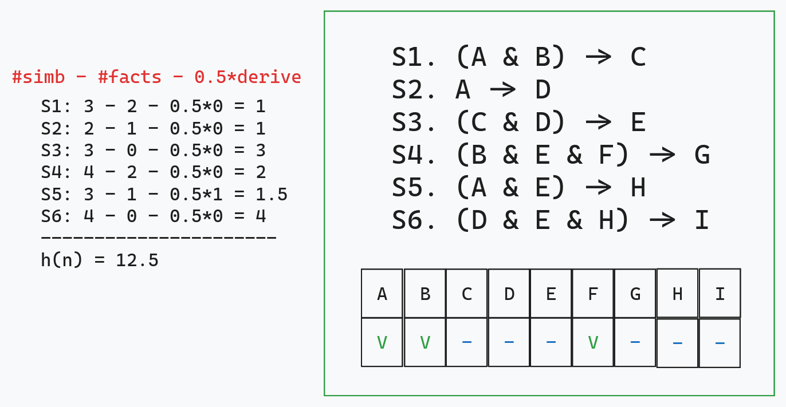
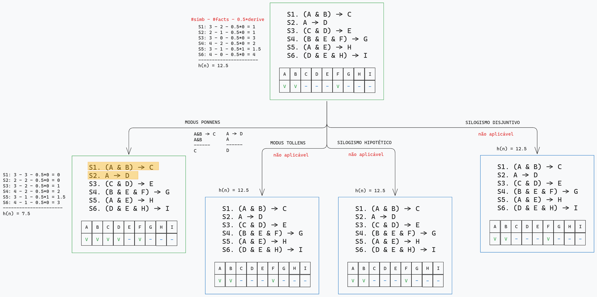
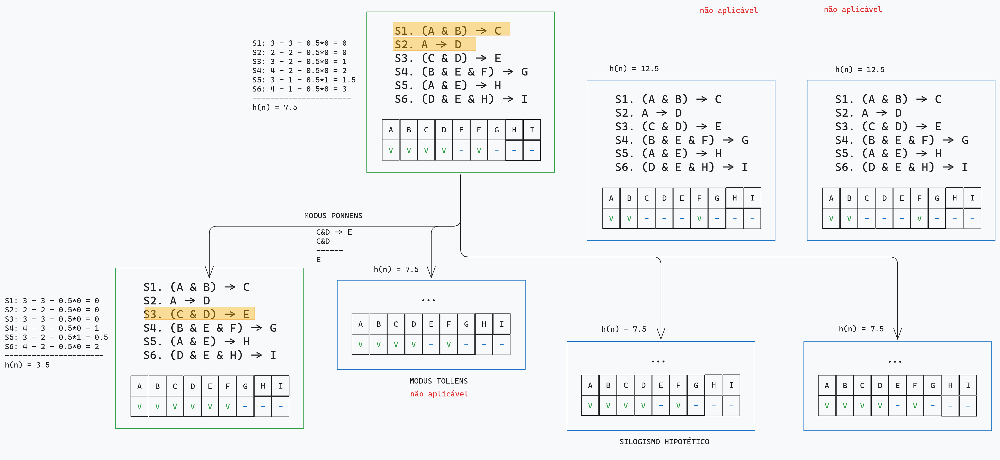
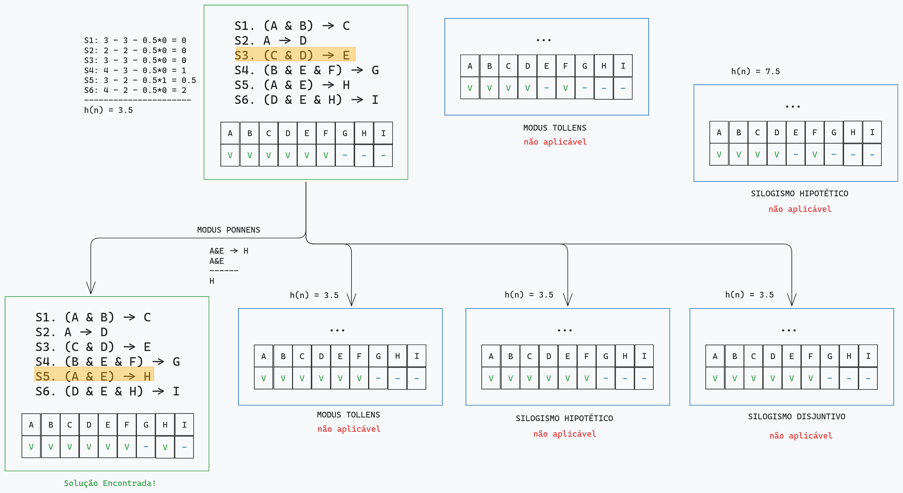
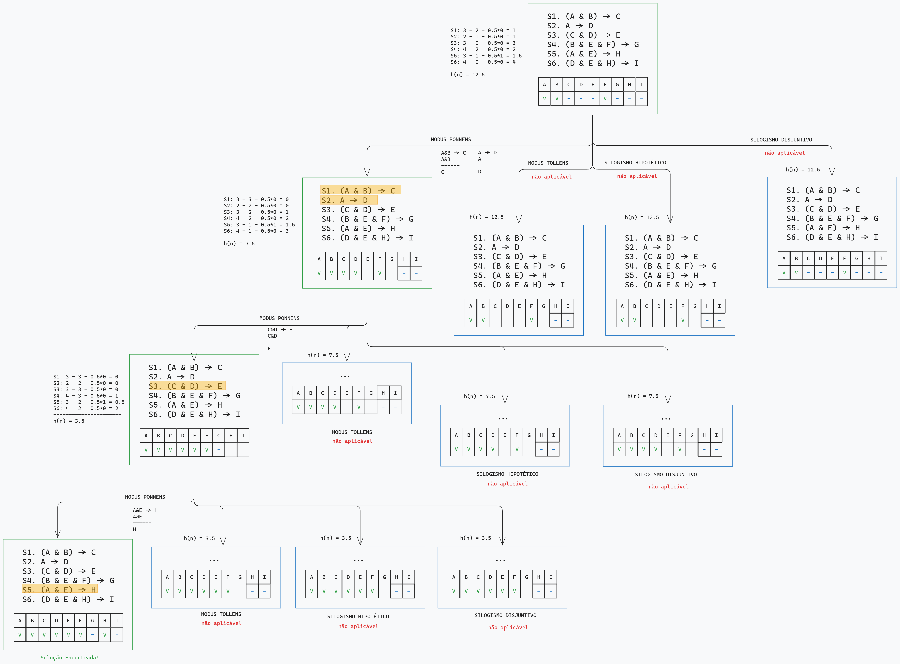

<!-- markdownlint-disable -->

# Prova IA - AB2

## Questão 3

Thiago Ribeiro da Silva

---

## Enunciado:

3. Mostre uma solução de busca heurística para um provador de teoremas na lógica proposicional. Considere uma base de conhecimento (equivalente a regras e fatos) formada pelas sentenças de 1 a 9. Usando tais sentenças, prove H a partir delas.

Regras:

- Modus Ponnens
- Modus Tollens
- Silogismo Hipotético
- Silogismo Disjuntivo


---

## Estrutura do Problema

- Seguindo o projeto entregue na lista 1 ([infero](https://github.com/ThiagoORuby/infero)), a estrutura consiste em estados representado por um conjunto de sentenças e de fatos:

```bash
rules:
A & B -> C
A -> D
C & D -> E
B & E & F -> G
A & E -> H
D & E & H -> I
end

facts:
A
B
F
end
```

---

## Algoritmo

- Partindo de um estado inicial, seus vizinhos são determinados tentando aplicar as regras lógicas sobre todas as sentenças disponíveis
- A escolha do melhor vizinho parte de um cálculo de heurística que envolve determinar a quantidade de símbolos de cada sentença não pertencentes aos fatos do problema, subtraído de um fator de 0.5 para quando o objetivo é derivado da sentença:

$$
h(estado) = \sum_{i = 1}^{k} = \#simbolos_{S_i} - \#fatos_{S_i} - 0.5*deriva(objetivo, S_i)
$$

- O melhor vizinho, então, segue sendo o de menor custo total

---

## Algoritmo

- Exemplo de cálculo de heurística



---

## Algoritmo

- Uma primeira opção seria o uso de um algoritmo guloso, focado somente em $h(n)$

```bash
FUNC greedy_algorithm(estado_inicial, objetivo) -> solução
    visitados := [] # explorados
    fila_prioritaria := [(estado_inicial, h(estado_inicial))] # borda
    ENQUANTO fila_prioritaria tem elementos:
        estado_atual := fila_prioritaria.pop()
        SE estado_atual.fatos(objetivo):
            RETORNA solução(estado_atual)

        visitados.add(estado_atual)
        PARA CADA vizinho DE estado_atual:
            SE vizinho NÃO está em visitados:
                fila_prioritaria.push((vizinho, h(vizinho)) # f(n) = h(n)
```

---

## Algoritmo

- Uma segunda opção seria o A\*, sendo $g(n)$ a quantidade de operações (regras lógicas) aplicadas, o que poderia ajudar na busca da solução ótima, por envolver menos uso de regras

```bash
FUNC astar(estado_inicial, objetivo) -> solução
    visitados := [] # explorados
    g := {estado_inicial: 0} # g(n)
    fila_prioritaria := [(estado_inicial, h(estado_inicial))] # borda
    ENQUANTO fila_prioritaria tem elementos:
        estado_atual := fila_prioritaria.pop()
        SE estado_atual.fatos(objetivo):
            RETORNA solução(estado_atual)

        visitados.add(estado_atual)
        PARA CADA vizinho DE estado_atual:
            custo_caminho := g[estado_atual] + 1
            SE vizinho NÃO está em g OU custo_caminho < g[vizinho]:
                g[vizinho] = custo_caminho
                SE vizinho NÃO está em visitados:
                    fila_prioritaria.push((vizinho, h(vizinho) + g(vizinho)) # f(n) = h(n) + g(n)

```

---

# Algoritmo: Passo a Passo

- De início, apenas **Modus Ponens** pode ser aplicado, o que torna a escolha do estado derivado dele a melhor opção:



---

# Algoritmo: Passo a Passo

- O mesmo acontece pra próxima expansão



---

# Algoritmo: Passo a Passo

- E consequentemente para a última



---

<section style="transform: scale(0.75);">
<h3>Árvore de Estados</h3>

```bash
Modus Ponens
A & B -> C
A & B
-----
C

Modus Ponens
A -> D
A
-----
D

Modus Ponens
C & D -> E
C & D
-----
E

Modus Ponens
A & E -> H
A & E
-----
H

Then H
```



</section>
